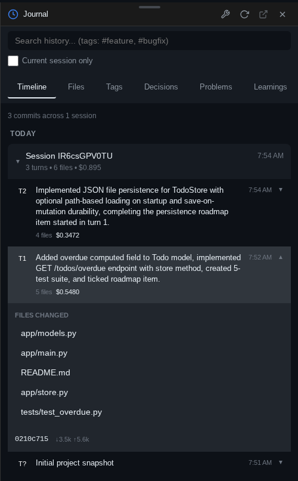
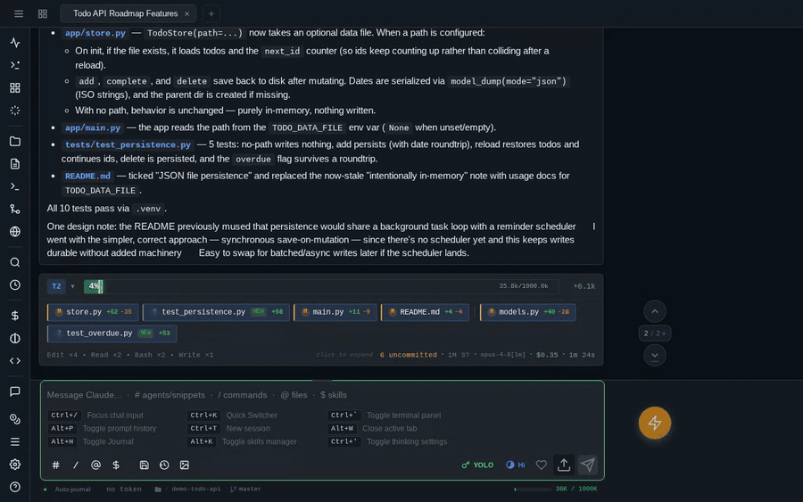
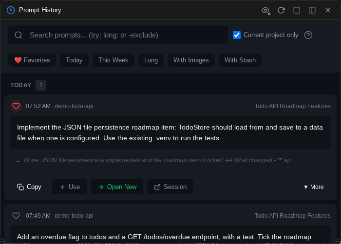

# pAInapple Code

A self-hosted web client for [Claude Code](https://github.com/anthropics/claude-code), installable as a PWA. The server **runs on your own machine** and drives Claude Code through the **official Agent SDK**, using **your own Claude subscription**. [OpenAI Codex CLI](https://painapple.ai/guides/engines/) support is experimental.
Inspired by [code-server](https://github.com/coder/code-server).

Thanks to the [**Auto Journal**](#auto-journal-shadow-git), you can easily **pull up the full history of any topic or file** you've already worked on. After each turn finishes, the session is forked in the background to a fast model (Haiku by default) that summarizes the turn — and the summary is stored in a local DuckDB and in the project's shadow git, as the commit message over everything that changed during the turn. **It's not just for you:** the optional `shadow-git-helper` agent gives Claude the same access, digging through past turns to brief the session with full historical context.

Right now it's a PWA, but **desktop and mobile apps are in development**.

**[Documentation](https://painapple.ai/)** · [Install](https://painapple.ai/getting-started/install-pip/) · [Features](https://painapple.ai/features/) · [Security](https://painapple.ai/getting-started/security/)


## Before you start

**This is an MVP, and heavily "vibe-coded".** All of the code was written by AI. I try to keep the security hygiene tight, but I can't promise there isn't an RCE hiding somewhere — one more reason to take the isolation advice in [Security model](#security-model) seriously. **A rewrite to a more rigorous standard is planned;** for now there are plenty of ideas I want to implement and test first.

## Security model

**Whoever can authenticate to pAInapple Code gets the shell and filesystem authority of the OS user that runs it.** pAInapple Code exists to run a coding agent on your behalf — `/api/exec`, the embedded PTY, and every approved tool call execute as that user. Treat the password like an SSH key.

The embedded terminal is a **real PTY**, and anything Claude is approved to run **executes as the user who started the server** — prompt injection and poisoned packages are real risks for *any* coding agent.

The server binds `127.0.0.1` over plain HTTP by default; non-loopback binds auto-enable TLS with a self-signed cert. Auth is a single-password gate — adequate on a home network or behind a personal VPN. **I strongly discourage exposing it on a public interface.**

It is **single-user, not multi-tenant**. Don't share one instance between people who shouldn't have each other's shell access; run separate instances as separate OS users instead. → [Security notes](https://painapple.ai/getting-started/security/)

**Found a vulnerability?** Please report it privately — see [`SECURITY.md`](SECURITY.md).

### Simple isolation with the built-in Docker/Podman instance manager

If you have Docker or Podman installed, add the **`--in-docker`** flag: it **automatically creates and runs a container** from an image that already has the basic development tools, the Claude Code CLI, and pAInapple Code itself.

```bash
pipx install painapple-code
painapple --in-docker                     # sandbox the current directory, foreground
painapple --in-docker --workspace ~/dev/  # sandbox ~/dev/ instead, foreground
```

For a sandbox you come back to, create a **named instance**. The wizard asks for the workspace, port, and container settings; after that the usual verbs manage it:

```bash
painapple setup myapp          # wizard — pick "Docker" as the run mode
painapple start myapp          # detached, comes back up with the runtime
painapple list                 # every instance, host or container, running or not
painapple password myapp       # print its login URL
painapple stop myapp
```

Full reference: [Docker & container mode](https://painapple.ai/getting-started/install-docker/).

## What it is, and what it isn't

**It is** a thin wrapper around Claude Code — every prompt streams through the official CLI/Agent SDK, and any session started here can be resumed in the plain CLI with `claude --resume <id>`. **It never modifies Claude's system prompt, tool policy, or behavior** — no injected planning steps, no hidden instructions. What it does add to a prompt is the context you attached: the output of `!bang` commands you ran, paths of files you uploaded, and snippets from the comments stash are prepended as plain text. The same wrapper can drive the [OpenAI Codex CLI](https://painapple.ai/guides/engines/), selected per session, resumable with `codex exec resume <id>` — the Codex path is **newer and has had less testing** than the Claude path.

**It is not** a hosted service. You run it, on your hardware, with your own Claude account.

**It is not zero-config "code from anywhere".** The client works as a PWA on a phone or iPad, but the networking between them is yours to wire up. The practical path: keep the default `127.0.0.1` bind and add a reverse proxy (Caddy, nginx) or a VPN for remote access — mobile browsers handle self-signed certificates poorly.

## Requirements

- **Server:** Linux, macOS, or Windows 10/11 — **natively, no WSL required**. ([Windows notes](https://painapple.ai/getting-started/requirements/#windows-notes): install the Claude CLI with `irm https://claude.ai/install.ps1 | iex`, not npm.)
- **Direct install:** Python 3.12+ and the [Claude Code CLI](https://github.com/anthropics/claude-code), installed and authenticated. (The Docker image ships Python and Node, and installs the agent CLIs itself on first start.)
- **Git** on `PATH` — the auto-journal records every turn as a shadow-git commit, and the Git panel shells out to it. **Without git the server still runs, but journals nothing.** (Windows: [Git for Windows](https://git-scm.com/download/win), which also provides the bash the optional helpers run under.)
- **Optional:** Docker or Podman, if you want the sandboxed `--in-docker` run mode and the named container instances.
- **Optional:** the [OpenAI Codex CLI](https://github.com/openai/codex), if you want the Codex engine.
- **Client:** any modern browser with network access to the server.

## Quick start

### pipx (recommended)

No pipx yet? It's two lines (or `brew install pipx` on macOS):

```bash
python3 -m pip install --user pipx
python3 -m pipx ensurepath
```

Then:

```bash
pipx install painapple-code

# Recommended: sandbox each instance in a container (see above).
cd ~/code/my-project
painapple --in-docker

# …or run it straight on the host — it serves the current directory:
painapple
# …or point it at a workspace holding several projects:
painapple --workspace /path/to/your/projects
```

**Installing on the host doesn't mean running on the host.** One pipx install manages both: bare is the simplest setup, `--in-docker` gives each instance its own sandbox without a separate install.

The console prints the **app URL with a generated password embedded** — open it once and a cookie keeps you logged in.

Plain `pip install painapple-code` into a venv works too — see the [pip/pipx guide](https://painapple.ai/getting-started/install-pip/).

In container mode the image is pulled automatically on the first run; `painapple pull` re-fetches it to update or pin a release. State persists in named volumes and your project is bind-mounted. Raw `docker run` / compose / Podman recipes and source builds: [Docker install guide](https://painapple.ai/getting-started/install-docker/).

### Desktop & mobile apps (in development)

Desktop and mobile apps are in development — stay tuned.

### More ways to run it

- **GitHub Codespaces / Dev Containers** — one line in `devcontainer.json` boots every Codespace with pAInapple Code installed, started, and port-forwarded → [Dev Container Feature](https://painapple.ai/getting-started/install-devcontainer/)
- **From source** — `git clone`, `venv/bin/pip install -e .`, run with `venv/bin/painapple` → [source install](https://painapple.ai/getting-started/install-pip/#from-a-source-checkout)

## Authentication

**Every HTTP and WebSocket request needs a password.** The server generates one on first start, stores it in `~/.config/painapple-code/config.yaml` (inside the container that's under `/home/app/`; **owner-only either way** — mode 0600 on Unix, an owner-only NTFS ACL on Windows), and logs a bootstrap URL with the token embedded as `?tkn=…` — open it once, the cookie does the rest.

```bash
# Reveal the password — prints ready-to-open login URLs
painapple password                # add a profile name for named deployments
# …or read the config file directly
awk '/^password:/ {print $2}' ~/.config/painapple-code/config.yaml
# …or in a container not managed by the CLI
docker exec painapple-code awk '/^password:/ {print $2}' \
    /home/app/.config/painapple-code/config.yaml

# Rotate: delete the config, restart, and a new password is generated
rm ~/.config/painapple-code/config.yaml   # then restart the server
# …or when running in a container
docker exec painapple-code rm /home/app/.config/painapple-code/config.yaml \
    && docker restart painapple-code
```

**Three auth paths:** the `bridge_auth` cookie (set automatically after first login), `?tkn=<password>` in any URL, or `Authorization: Bearer <password>` for `curl` and scripts.

## Server options

The most common flags:

| Flag | Default | Description |
|------|---------|-------------|
| `--host` / `--port` | `127.0.0.1` / `8765` | Bind address and port |
| `--workspace` | `.` | Workspace root — the directory holding your projects. You pick the project in-app from the welcome screen (`--cwd` is an alias) |
| `--instance-name`, `--accent` | — | Label + accent color to distinguish multiple instances |
| `--tls` | `auto` | Self-signed TLS, auto-enabled on non-loopback binds |
| `--default-provider` | `claude-sdk` | Default [AI engine](https://painapple.ai/guides/engines/) for new sessions — Claude Code (SDK or classic line protocol) or OpenAI Codex |
| `--profile` | — | Run a named profile — several independent deployments (host or docker mode) under one user |
| `--in-docker` | off | Run the same invocation in a container instead (prebuilt image, cwd mounted) |

`painapple setup` is an interactive wizard that saves global defaults (network/TLS + the container runtime for `--in-docker`); `painapple setup NAME` creates a named deployment — host or docker mode — that `painapple start NAME` runs in the background. **`painapple list`** shows **every instance on the machine**, and `status`/`logs`/`password NAME` inspect any of them.

`painapple --help` prints the full list; every flag, environment variable, and accent-color preset is in the [server CLI reference](https://painapple.ai/reference/server-cli/).

## Highlighted features

A selection — the full list is in the [feature docs](https://painapple.ai/features/).

### Auto Journal (shadow git)

After each turn, the session forks itself in the background to a fast summarizer model (Haiku by default) that reads the **whole turn, not just the diff**. Its structured write-up — work done, decisions, learnings, problems solved — becomes the commit message for a per-project shadow git repo holding that turn's file changes (respecting `.gitignore`), and the same fields land in a local DuckDB, so the project's own history is **queryable**: from the Journal widget, over a SQL endpoint, or by future sessions.

That last case is what the optional **`shadow-git-helper`** agent is for — write **"consult shadow-git-helper about X"** and a sub-agent digs through past turns without loading them into your main context. It's **not a backup mechanism**; it's a **searchable record of what was done and why**.



### Per-turn summary bar

Context usage, token delta, files changed with diff stats, tool counts, duration, cost, and which model ran — **inline after every turn**. File pills open diffs and previews directly.


### Comments stash

Click the bubble next to any paragraph, add a note, and it **attaches — quote included — to your next prompt**.

**Screenshots ride the same mechanism.** Paste an image and the annotation editor opens (pen, arrow, box, text) — drop a **numbered marker** anywhere on it, type a note, and that note lands in the same stash as *"Marker 2 on screenshot.png"*. The badge pins the spot on the picture, the comment travels as prompt text, and the annotated image is attached to the same message, so the model can connect the two.



### Embedded terminal

A **real PTY** via xterm.js (`` Ctrl+` ``). On mobile there's a key bar with Ctrl/Alt/arrows above the keyboard, and a virtual d-pad joystick on touch-and-hold.


### Prompt history + favorites

Search **every prompt you've ever sent**, across all sessions and projects, with phrase, exclusion, date, and content filters (`Alt+P` or `Ctrl+R`). Mark favorites; reuse any result or fork it into a new session.



### And more

→ [All features](https://painapple.ai/features/)

## Optional helpers

A `shadow-git` CLI, a `shadow-query` DuckDB wrapper, and the `shadow-git-helper` Claude agent ship with the package — the Docker image installs all three at build time. On a host install:

```bash
src/painapple_code/tools/install-helpers.sh   # --update / --uninstall / --dry-run
```

**No `sudo`, no `$PATH` edits** — targets `~/.local/bin` and `~/.claude/agents/`. Details: [optional helpers reference](https://painapple.ai/reference/optional-helpers/).

## Data storage

Everything lives under `~/.painapple-code/` (or `$PAINAPPLE_CODE_HOME`; `/data` in Docker): per-project sessions, shadow git repos, the DuckDB turn store, and logs. Auth config sits apart in `~/.config/painapple-code/config.yaml` (owner-only: mode 0600 on Unix, an NTFS ACL on Windows), so **wiping the data directory doesn't rotate your password**. Full layout: [data & storage reference](https://painapple.ai/reference/data-storage/).

## What it touches on your machine

pAInapple Code runs a coding agent, so it is not a light-touch program. Everything it does to your system, in one place:

**It does not write into your project.** No dotfiles, no metadata directory, no worktrees. Changes to your code come only from things you asked for — an approved tool call, the editor, the terminal, a shadow-git restore.

**Shadow git copies your project into the data home — on by default.** After each turn it commits the whole working tree, *including untracked files*, into a private repo under `~/.painapple-code/`. That's what powers the timeline, undo, and file history. It skips `.git`, `node_modules`, virtualenvs, build output, logs, `.env` files, and anything over 50 MB — but a secret in a file that *doesn't* match those exclusions (say `credentials.json`) gets copied there and kept in that repo's history. Worth knowing before you point it at a directory full of production keys; disable it per project in the Auto-journal settings.

**Auto-journal spends tokens in the background — on by default.** After each turn a second, short model call (Haiku by default) summarizes what happened to produce the journal entries and commit messages. It's cheap, but it is real API usage you didn't explicitly trigger. Same settings panel turns it off.

**Outside the data home it touches very little.** Auth config and TLS cert live in `~/.config/painapple-code/`, restricted to your account (mode 0600 on Unix; an owner-only ACL applied with `icacls` on Windows, since POSIX mode bits do nothing on NTFS). The optional helpers — only if you install them — add two scripts to `~/.local/bin/` and one agent file to `~/.claude/agents/`; no `sudo`, no `$PATH` or shell-rc edits. (On Windows the two scripts are bash, so each also gets a small generated `.cmd` wrapper beside it that invokes Git for Windows' bash — that's what lets you call them by name from the PowerShell terminal. Without Git for Windows they're skipped and only the agent file installs.) It reads `~/.claude/` and `$CODEX_HOME` to list your existing skills, agents, commands, and models.

**Nothing phones home.** No telemetry, no update checks, no analytics. The only outbound request the server itself makes is the browser widget fetching a URL you asked it to open (guarded against internal-network addresses). The Claude and Codex CLIs it launches talk to their own vendors, as they would anyway.

**In Docker, the Claude home is isolated by default.** Containers get their own `~/.painapple-code/shared/.claude` rather than a mount of your host `~/.claude`, so one `claude login` serves every sandbox without any of them being able to touch your host config. The setup wizard can seed that isolated home from your host login once, and you can point `claude_home` at the host copy explicitly if you'd rather share it.

**Uninstalling the package leaves your data.** `~/.painapple-code/` (sessions, shadow repos, the DuckDB store) and `~/.config/painapple-code/` (password, cert) stay until you delete them; the helpers have their own uninstall flag. Full inventory: [data & storage reference](https://painapple.ai/reference/data-storage/).

## Known weaknesses

This is an MVP — there are tradeoffs.

1. **Windows support is new** — the server now runs natively on Windows 10/11, no WSL: the terminal is ConPTY-backed, file locking and process control have Windows implementations, and CI smoke-tests install/import/boot on every push. But it is by far the **youngest and least-exercised platform** — Linux is where this is developed and used daily. Expect rougher edges than on Linux or macOS. Two deliberate differences: the terminal tab runs **PowerShell** (so `!bang` commands are PowerShell-flavored, not `sh`), and the optional `shadow-git`/`shadow-query` helpers are shell scripts that need **Git for Windows** to provide a bash.
2. **Windowing system** — works, but doesn't support multiple instances of the same widget and could use a rethink.
3. **Code editor** — currently a notepad with syntax highlighting. The plan is a review-driven workflow rather than a VSCode-grade editor; the markdown inline editor is the exception and works well for plan/doc tweaks.
4. **GUI for OS-level features** (git widget, file explorer) — exists, but I prefer the embedded terminal for `grep`/`sed`/`find`/`du`, so these widgets have not been a priority.
5. **Codex engine** — functional, but much newer than the Claude path and not yet as thoroughly tested.

## License

Copyright (C) 2026 Michał Booth-Wrotkowski

AGPL 3.0 or later — see [`LICENSE`](LICENSE). This program is free software: you can redistribute it and/or modify it under the terms of the GNU Affero General Public License as published by the Free Software Foundation, either version 3 of the License, or (at your option) any later version. It is distributed WITHOUT ANY WARRANTY; see the license for details.

Because §13 covers network use, the running app offers its own source: the About panel links to the repository.
