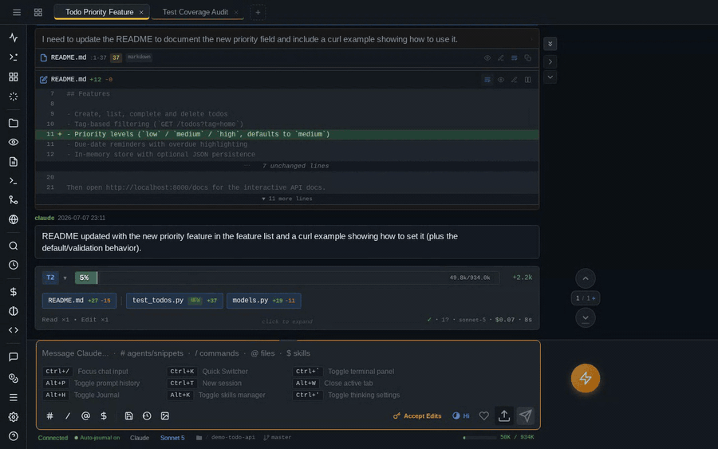
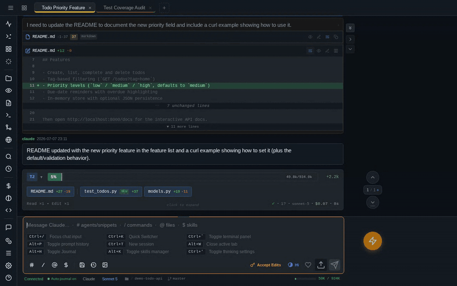

# pAInapple Code

A self-hosted web client for [Claude Code](https://github.com/anthropics/claude-code), installable as a PWA. The server **runs on your own machine** and drives Claude Code through the **official Agent SDK**, using **your own Claude subscription**. [OpenAI Codex CLI](https://painapple.ai/guides/providers/) support is experimental.
Inspired by [code-server](https://github.com/coder/code-server).

[**Auto Journal**](#auto-journal-shadow-git): after every turn, a background fork to a fast model (Haiku by default) summarizes it into a local DuckDB and a shadow-git commit — so the **full history of any topic or file stays searchable**, by you *and* by future Claude sessions.

Right now it's a PWA, but **desktop and mobile apps are in development**.

[What it is](#what-it-is-and-what-it-isnt) · [Security](#security-model) · [Features](#highlighted-features) · [Requirements](#requirements) · [Quick start](#quick-start) · [Known weaknesses](#known-weaknesses)


## What it is, and what it isn't

**It is** a thin wrapper around Claude Code — every prompt streams through the official CLI/Agent SDK, and any session started here can be resumed in the plain CLI with `claude --resume <id>`. **It never modifies Claude's system prompt, tool policy, or behavior** — no injected planning steps, no hidden instructions. What it does add to a prompt is the context you attached: the output of `!bang` commands you ran, paths of files you uploaded, and snippets from the comments stash are prepended as plain text. The same wrapper can drive the [OpenAI Codex CLI](https://painapple.ai/guides/providers/), selected per session, resumable with `codex exec resume <id>` — the Codex path is **newer and has had less testing** than the Claude path.

**It is not** a hosted service. You run it, on your hardware, with your own Claude account.

**It is not zero-config "code from anywhere".** The client works as a PWA on a phone or iPad, but the networking between them is yours to wire up. The practical path: keep the default `127.0.0.1` bind and add a reverse proxy (Caddy, nginx) or a VPN for remote access — mobile browsers handle self-signed certificates poorly.

## Security model

**This is an MVP, and heavily "vibe-coded".** All of the code was written by AI. I try to keep the security hygiene tight, but I can't promise there isn't an RCE hiding somewhere — one more reason to take the isolation advice below seriously. **A rewrite to a more rigorous standard is planned;** for now there are plenty of ideas I want to implement and test first.

**Whoever can authenticate to pAInapple Code gets the same shell and filesystem access as the server process itself.** It exists to run a coding agent on your behalf — `/api/exec`, the embedded PTY, and every approved tool call execute with the server's privileges: on a bare host install that's your OS user; in container mode it's the sandbox. Prompt injection and poisoned packages are real risks for *any* coding agent.

The server binds `127.0.0.1` over plain HTTP by default; non-loopback binds auto-enable TLS with a self-signed cert. Auth is a single-password gate — adequate on a home network or behind a personal VPN. **I strongly discourage exposing it on a public interface.**

It is **single-user, not multi-tenant**. Don't share one instance between people who shouldn't have each other's shell access; run separate instances as separate OS users instead. → [Security notes](https://painapple.ai/getting-started/security/)

**The easiest mitigation is the built-in container mode:** `painapple --in-docker` sandboxes a workspace in a prebuilt image with the dev tools and agent CLIs included ([Quick start](#quick-start)), and `painapple setup NAME` creates named, persistent sandboxes ([Server options](#server-options)). Full reference: [Docker & container mode](https://painapple.ai/getting-started/install-docker/).

**Found a vulnerability?** Please report it privately — see [`SECURITY.md`](SECURITY.md).

## Highlighted features

A selection — the full list is in the [feature docs](https://painapple.ai/features/).

### Auto Journal (shadow git)

After each turn, the session forks itself in the background to a fast summarizer model (Haiku by default) that reads the **whole turn, not just the diff**. Its structured write-up — work done, decisions, learnings, problems solved — becomes the commit message for a per-project shadow git repo holding that turn's file changes (respecting `.gitignore`), and the same fields land in a local DuckDB, so the project's own history is **queryable**: from the Journal widget, over a SQL endpoint, or by future sessions.

That last case is what the optional **`shadow-git-helper`** agent is for — say **"consult shadow-git-helper about X"** and a sub-agent digs through past turns without loading them into your main context. It's **not a backup mechanism**; it's a **searchable record of what was done and why**.


### Per-turn summary bar

Context usage, token delta, files changed with diff stats, tool counts, duration, cost, and which model ran — **inline after every turn**. File pills open diffs and previews directly.


### Quick Switcher

One `Ctrl/Cmd+K` popup to jump anywhere — VS-Code-style **fuzzy file search** (recent files first), with prefix modes for everything else: `>` commands, `#` panels, `~` projects, `$` skills, `!` files Claude read this session. `~` drills into any project's **sessions** and opens them as tabs; `Ctrl+click` opens a file in a background tab.



### Chat input autocomplete

The message box completes as you type: **`@` files** (recents first), **`#` agents & saved snippets**, **`$` skills**, **`/` commands** — plus **`!` for shell mode**, whose command output rides along as context for your next prompt. `Tab` on an empty input cycles through all of them.



### Comments stash

Click the bubble next to any paragraph, add a note, and it **attaches — quote included — to your next prompt**.

**Screenshots ride the same mechanism.** Paste an image and the annotation editor opens (pen, arrow, box, text) — drop a **numbered marker** anywhere on it, type a note, and that note lands in the same stash as *"Marker 2 on screenshot.png"*. The badge pins the spot on the picture, the comment travels as prompt text, and the annotated image is attached to the same message, so the model can connect the two.


### Embedded terminal

A **real PTY** via xterm.js (`` Ctrl+` ``). On mobile there's a key bar with Ctrl/Alt/arrows above the keyboard, and a virtual d-pad joystick on touch-and-hold.

### Prompt history + favorites

Search **every prompt you've ever sent**, across all sessions and projects, with phrase, exclusion, date, and content filters (`Alt+P` or `Ctrl+R`). Mark favorites; reuse any result or fork it into a new session.

### And more

→ [All features](https://painapple.ai/features/)

## Requirements

- **Server:** Linux, macOS, or Windows 11 (Windows 10 is untested, but will probably work)
- **Direct install:** Python 3.12+ and the [Claude Code CLI](https://github.com/anthropics/claude-code), installed and authenticated. (The Docker image ships Python and Node, and installs the agent CLIs itself on first start.)
- **Git** on `PATH` — the auto-journal records every turn as a shadow-git commit, and the Git panel shells out to it. **Without git the server still runs, but journals nothing.** (Windows: [Git for Windows](https://git-scm.com/download/win).)
- **Optional:** Docker or Podman for the sandboxed `--in-docker` mode and named container instances; the [OpenAI Codex CLI](https://github.com/openai/codex) for the Codex provider.
- **Client:** any modern browser with network access to the server.

## Quick start

One install with [pipx](https://pipx.pypa.io/), then run `painapple` from the directory that **holds your projects** — one instance serves them all, and you pick the project to work on from the welcome screen.

### macOS & Linux

```bash
# 1. Install pipx — pick your line (skip if you have it)
brew install pipx && pipx ensurepath          # macOS (Homebrew)
sudo apt install pipx && pipx ensurepath      # Debian/Ubuntu
python3 -m pip install --user pipx && python3 -m pipx ensurepath   # anywhere else

# 2. Install pAInapple Code
pipx install painapple-code

# 3. Run it from the directory that holds your projects
cd ~/code
painapple --in-docker      # recommended: sandboxed in a container
painapple                  # …or straight on the host, serving the current directory
```

Container mode uses whichever of Docker or Podman it finds — Docker Desktop, OrbStack, and rootless Podman all work. Without one, use the bare `painapple`.

**Intel Macs:** everything works out of the box except `--tls`. To enable it, install as `pipx install "painapple-code[tls]"` — the extra pulls the last `cryptography` release that still ships an Intel wheel, so nothing compiles. Apple Silicon is unaffected.

### Windows

Runs **natively** on Windows. WSL2 is just a Linux VM, so it should work there without any issues — unfortunately I couldn't test it: WSL2 inside a Windows VM needs nested virtualization, which neither Apple's hypervisor nor the Windows VM I rented supports.

Open *Terminal* or *Windows PowerShell* from the Start menu and paste.

```powershell
# 1. Prerequisites (skip what you already have)
winget install Python.Python.3.13
winget install Git.Git

# 2. Install pipx, then pAInapple Code
python -m pip install --user pipx
python -m pipx ensurepath
# reopen PowerShell so the PATH change takes effect
pipx install painapple-code

# 3. Run it from the directory that holds your projects
cd C:\Users\you\projects
painapple
```

Git for Windows is worth installing even if you use another git: the optional [helpers](#optional-helpers) are shell scripts that run under the `bash.exe` it ships. The built-in terminal tab runs PowerShell (`pwsh` when present), and `!bang` commands are PowerShell-flavored.

**Prefer WSL2?** Likely the safer bet: inside the distro this *is* the daily-exercised Linux build, and container mode (`--in-docker`) — the one thing native Windows can't do — works there too. Follow the [macOS & Linux](#macos--linux) steps verbatim. Two things to know: keep your projects on the Linux filesystem (`~/code/…`, not `/mnt/c/…` — file watching and git are painfully slow across the mount), and open the printed URL in your Windows browser as-is — WSL2 forwards `localhost` through for you.

**Windows on ARM** (Surface, Snapdragon X) installs with no extra flags. Two upstream wheels are missing, both handled for you: the HTTP parser falls back to pure Python, and `--tls` needs `pipx install "painapple-code[tls]"`. Use a 64-bit Python.

### Then what?

The console prints the **app URL with a login token embedded** — open it in a browser on that machine, pick a project on the welcome screen, and you're in. It's a full PWA, so you can install it as a standalone app: **macOS Safari** → File → *Add to Dock*, **Chrome / Edge** (Windows, Linux, macOS) → the install icon in the address bar.

By default the server binds to `127.0.0.1`, so that URL only works on the machine it runs on. **Reaching it from a phone or tablet is optional and takes a bit more setup**: bind wider with `--host 0.0.0.0` (non-loopback binds auto-enable TLS with a self-signed certificate — you'll accept a one-time browser warning), or put a reverse proxy with a real domain and certificate in front, which is what iOS/iPadOS wants before it will install the PWA properly. Read the [security notes](https://painapple.ai/getting-started/security/) before exposing it beyond your own machine, and the [iPad & mobile guide](https://painapple.ai/guides/ipad-and-mobile/) for the full walkthrough.

In container mode the image is pulled automatically on the first run (`painapple pull` re-fetches it to update or pin a release); state persists in named volumes and your projects are bind-mounted. Running it inside a single project works too, and `--workspace /path` serves any folder without `cd`-ing there.

### More ways to run it

- **Docker / Podman directly** — raw `docker run`, compose files, Podman flags and source builds → [Docker install guide](https://painapple.ai/getting-started/install-docker/)
- **pip into a venv** — plain `pip install painapple-code` works the same way → [pip/pipx guide](https://painapple.ai/getting-started/install-pip/)
- **GitHub Codespaces / Dev Containers** — one line in `devcontainer.json` boots every Codespace with pAInapple Code installed, started, and port-forwarded → [Dev Container Feature](https://painapple.ai/getting-started/install-devcontainer/)
- **From source** — `git clone`, `venv/bin/pip install -e .`, run with `venv/bin/painapple` → [source install](https://painapple.ai/getting-started/install-pip/#from-a-source-checkout)

**Full documentation** — configuration, providers, every feature, and the CLI/API reference — lives at **[painapple.ai](https://painapple.ai/)**.

## Authentication

**Every HTTP and WebSocket request needs a password.** The server generates one on first start and stores it owner-only in `~/.config/painapple-code/config.yaml` (under `/home/app/` inside the container). On a loopback bind it logs a bootstrap URL with the token embedded as `?tkn=…` — open it once, the cookie does the rest. Non-loopback binds (LAN, `0.0.0.0`, inside the container) hide credentials from stdout by default, since a server's console tends to end up in journald or `docker logs`; retrieve them with `painapple password`, or opt back in with `--show-password`.

```bash
# Reveal the password — prints ready-to-open login URLs
painapple password                # add a profile name for named deployments
# …or read the config file directly (in a container not managed by the CLI,
# prefix with `docker exec painapple-code` and use the /home/app/… path)
awk '/^password:/ {print $2}' ~/.config/painapple-code/config.yaml

# Rotate: delete the config and a new password is generated
rm ~/.config/painapple-code/config.yaml   # then restart the server
```

**Three auth paths:** the `painapple_auth` cookie (set automatically after first login), `?tkn=<api_token>` in any URL, or `Authorization: Bearer <api_token>` for `curl` and scripts. **None of them carries the password itself** — cookies and tokens are HMAC-derived from it, so a shared bootstrap link or a CI secret can't open the login form, and each side is revocable independently (log out every browser, or kill every script token, without touching the other). Details in the [security notes](https://painapple.ai/getting-started/security/).

## Server options

The most common flags:

| Flag | Default | Description |
|------|---------|-------------|
| `--host` / `--port` | `127.0.0.1` / `8765` | Bind address and port |
| `--workspace` | `.` | Workspace root — the directory holding your projects. You pick the project in-app from the welcome screen (`--cwd` is an alias) |
| `--instance-name`, `--accent` | — | Label + accent color to distinguish multiple instances |
| `--tls` | `auto` | Self-signed TLS, auto-enabled on non-loopback binds |
| `--default-provider` | `claude-sdk` | Default [AI provider](https://painapple.ai/guides/providers/) for new sessions — Claude Code (SDK or classic line protocol) or OpenAI Codex |
| `--profile` | — | Run a named profile — several independent deployments (host or docker mode) under one user |
| `--in-docker` | off | Run the same invocation in a container instead (prebuilt image, cwd mounted) |

`painapple setup` is an interactive wizard that saves global defaults (network/TLS + the container runtime for `--in-docker`); `painapple setup NAME` creates a named deployment — host or docker mode — that `painapple start NAME` runs in the background. **`painapple list`** shows **every instance on the machine**, and `status`/`logs`/`password NAME` inspect any of them.

`painapple --help` prints the full list; every flag, environment variable, and accent-color preset is in the [server CLI reference](https://painapple.ai/reference/server-cli/).

## Optional helpers

A `shadow-git` CLI, a `shadow-query` DuckDB wrapper, and the `shadow-git-helper` Claude agent ship with the package — the Docker image installs all three at build time. On a host install:

```bash
src/painapple_code/tools/install-helpers.sh   # --update / --uninstall / --dry-run
```

**No `sudo`, no `$PATH` edits** — targets `~/.local/bin` and `~/.claude/agents/`. Details: [optional helpers reference](https://painapple.ai/reference/optional-helpers/).

## What it touches on your machine

pAInapple Code runs a coding agent, so it is not a light-touch program. Its own state — per-project sessions, shadow git repos, the DuckDB turn store, logs — lives under `~/.painapple-code/` (or `$PAINAPPLE_CODE_HOME`; `/data` in Docker). Everything else it does to your system, in one place:

**It does not write into your project.** No dotfiles, no metadata directory, no worktrees. Changes to your code come only from things you asked for — an approved tool call, the editor, the terminal, a shadow-git restore.

**Shadow git copies your project into the data home — on by default.** After each turn it commits the whole working tree, *including untracked files*, into a private repo under `~/.painapple-code/` — that's what powers the timeline, undo, and file history; disable it per project in the Auto-journal settings. It skips `.git`, `node_modules`, virtualenvs, build output, logs, `.env` files, and anything over 50 MB — but a secret in a file that *doesn't* match those exclusions (say `credentials.json`) gets copied there and kept in that repo's history. Worth knowing before you point it at a directory full of production keys.

**Auto-journal spends tokens in the background — on by default.** After each turn a second, short model call (Haiku by default) summarizes what happened to produce the journal entries and commit messages. It's cheap, but it is real API usage you didn't explicitly trigger. Same settings panel turns it off.

**Outside the data home it touches very little.** Auth config and TLS cert live in `~/.config/painapple-code/`, owner-only (mode 0600 on Unix; an `icacls` owner-only ACL on Windows) — kept apart from the data home, so **wiping your data doesn't rotate your password**. The optional helpers — only if you install them — add two scripts to `~/.local/bin/` and one agent file to `~/.claude/agents/`; no `sudo`, no `$PATH` or shell-rc edits (on Windows each script gets a small `.cmd` wrapper so PowerShell can call it by name; they need Git for Windows' bash to run). It reads `~/.claude/` and `$CODEX_HOME` to list your existing skills, agents, commands, and models.

**Nothing phones home.** No telemetry, no update checks, no analytics. The only outbound request the server itself makes is the browser widget fetching a URL you asked it to open (guarded against internal-network addresses). The Claude and Codex CLIs it launches talk to their own vendors, as they would anyway.

**In Docker, the Claude home is isolated by default.** Containers get their own shared `.claude` under the data home rather than a mount of your host `~/.claude` — one `claude login` serves every sandbox, and none of them can touch your host config. The setup wizard can seed it from your host login once, or point `claude_home` at the host copy if you'd rather share it.

**Uninstalling the package leaves your data.** `~/.painapple-code/` (sessions, shadow repos, the DuckDB store) and `~/.config/painapple-code/` (password, cert) stay until you delete them; the helpers have their own uninstall flag. Full inventory: [data & storage reference](https://painapple.ai/reference/data-storage/).

## Known weaknesses

This is an MVP — there are tradeoffs.

1. **Windows support is new and not well tested** — the server runs natively (ConPTY terminal, Windows file locking and process control, CI smoke-tested on every push), but it is by far the **youngest and least-exercised platform**; Linux is where this is developed and used daily, so expect rougher edges. Running inside WSL2 is probably the better option — not explicitly tested either, but it runs the daily-exercised Linux build, so it should sidestep the native-Windows caveats.
2. **Windowing system** — works, but doesn't support multiple instances of the same widget and could use a rethink.
3. **Code editor** — currently a notepad with syntax highlighting. The plan is a review-driven workflow rather than a VSCode-grade editor; the markdown inline editor is the exception and works well for plan/doc tweaks.
4. **GUI for OS-level features** (git widget, file explorer) — exists, but I prefer the embedded terminal for `grep`/`sed`/`find`/`du`, so these widgets have not been a priority.
5. **Codex provider** — functional, but much newer than the Claude path and not yet as thoroughly tested.

## License

Copyright (C) 2026 Michał Booth-Wrotkowski

AGPL 3.0 or later — see [`LICENSE`](LICENSE). This program is free software: you can redistribute it and/or modify it under the terms of the GNU Affero General Public License as published by the Free Software Foundation, either version 3 of the License, or (at your option) any later version. It is distributed WITHOUT ANY WARRANTY; see the license for details.
