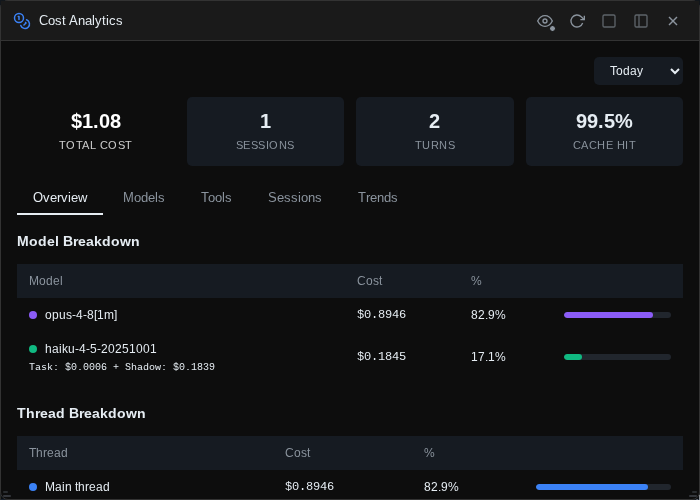

# Cost analytics & prompt history

Two widgets answer the questions every heavy Claude Code user eventually asks: *where is the money going?* and *where did I put that prompt?*

## Cost analytics

Press ++alt+4++ (or open it from the rail) for a floating cost dashboard built from the [Shadow DB](shadow-git.md) turn records.

A **time range selector** at the top scopes everything: All Time, Today (the default), 7 Days, 14 Days, or 30 Days. Below it, four **summary cards** show total cost, session count, turn count, and the prompt-cache hit rate.

Five tabs break the numbers down:

- **Overview** — cost per model (Opus / Sonnet / Haiku, with Haiku split into task vs. Shadow Git overhead), a **thread breakdown** (main thread vs. Task subagents vs. Shadow Git journaling), top projects, and headline efficiency metrics (cost per turn, work efficiency, cache savings).
- **Models** — a card per model with input/output token totals, call counts, cache read/write volumes, and effective cost per 1k tokens.
- **Tools** — cost attributed proportionally to the tools used in each turn: which of Read, Bash, Edit, … is actually driving your spend, with per-invocation averages.
- **Sessions** — your top 10 most expensive sessions, each with a per-model cost breakdown.
- **Trends** — a daily bar chart of spend over the selected window.

!!! note "Shadow Git overhead is broken out, not hidden"
    The Haiku calls that write your [Shadow Git journal](shadow-git.md) cost money too. The dashboard shows them as a separate "Shadow git" line everywhere Haiku appears, so you always know what the journal costs you.

## Prompt history

Press ++alt+p++ (or ++ctrl+r++, shell-style) to open the **prompt explorer** — full-text search over every prompt you have ever sent, across all projects and sessions.

Without a search, prompts are grouped by time period (Today, Yesterday, This Week, This Month, Older) and quick-filter chips offer one-tap views: Favorites, Today, This Week, Long, With Images, With Stash. A **"current project only"** checkbox (on by default) scopes results to the active session's project.

### Search syntax

Plain words are ANDed; everything else is operators. The **?** button next to the search box shows this same list in-app, and clicking a syntax hint inserts it into the query. Active operators appear as removable filter chips under the box.

| Syntax | Meaning |
|--------|---------|
| `"exact phrase"` | Exact phrase match |
| `-term` | Exclude term |
| `word1 OR word2` | Either term |
| `in:response` | Search Claude's responses instead of your prompts |
| `fav:` | Favorited prompts only |
| `long:` / `short:` | Long (>500 chars) / short (<100 chars) prompts |
| `has:image` / `has:stash` | Prompts with images / with stash context attached |
| `today:` / `yesterday:` / `week:` | Time shortcuts |
| `after:2026-01-15` / `before:2026-01-10` | Date bounds |
| `project:name` | Filter by project name (partial match) |

Matches are highlighted in the results.

### Working with results

Each prompt card shows when and in which project/session it was sent, the first ~300 characters, any attached stash references, and a one-line preview of Claude's response. The **♥ heart** marks a prompt as a favorite (searchable with `fav:`). **More** expands the card to the full prompt and fetches the complete rendered response.

Four actions per card:

- **Copy** — prompt text to the clipboard.
- **Use** — paste it into the current session's input (double-clicking the card does the same).
- **Open New** — start a fresh session in the prompt's original project with the text pre-filled, ready to edit and re-run.
- **Session** — open the original session and scroll to that exact prompt.

## Other inspection widgets

A few more panels for looking under the hood:

**Log explorer** (++alt+l++) — the current session's logs in three tabs: parsed **Messages**, the **Raw** JSON stream between the bridge and the CLI (rendered as a collapsible JSON tree), and large **Tools** outputs stored on disk. Supports pagination, role/error filtering, and sort order toggling — the closest thing to a flight recorder for a session.

**Active sessions** (++alt+s++) — a monitor of every Claude process the bridge is running: your sessions with their process state, background instances (like the Shadow Git summary forks) with history, and aggregate success-rate stats.

**Sub-agents** — a runtime monitor for Task-tool sub-agents in the current session: each spawned agent as a card with its status, token usage, and an expandable log of the tool calls it made. (Distinct from the Agents widget, which manages agent *definition* files.)

**Background tasks** — lists shell commands Claude started in the background, with live-tailing output and task management. It has no default shortcut; open it from the rail or bind a key in Settings → Shortcuts.
