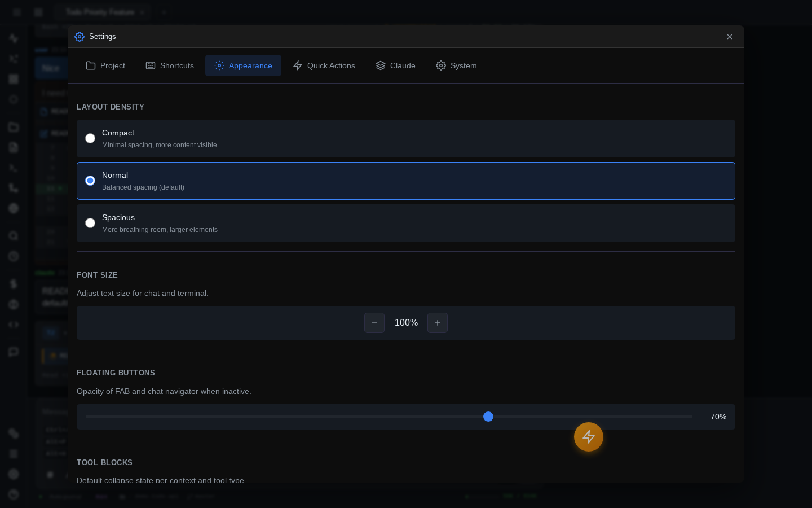

# Customization

Most of the UI bends to your preferences: keyboard shortcuts, layout density, the radial quick-actions menu, tool-block collapsing, models, and per-project behavior all live in one Settings widget.

## The Settings widget

Press ++ctrl+comma++ (also ++cmd+comma++ on macOS proper — iPadOS reserves that chord) to open Settings. Six tabs:

### Project

Shown when the active session has a working directory; settings here apply to that project only.

- **Path and hash** — where the project lives and its internal ID.
- **Additional directories** — extra paths passed to Claude via `--add-dir`, so it can read and edit outside the project root.
- **Shadow Git** — enable/disable the [auto-journal](shadow-git.md) for this project, toggle rich (AI-summarized) commits, and configure the **commit sections** the summary model fills in — enable/disable built-in sections or add custom ones with your own prompt instructions.

### Shortcuts

Every keyboard shortcut, searchable and rebindable. Type a name to filter, or type a key combo (`ctrl+k`) to find what's bound to it; filters for "customized only" and "conflicts only" help audits. Click a binding slot and **press the keys you want** — the editor captures the chord directly and flags conflicts with other bindings. **Reset All** puts everything back to defaults (two-click confirm).

Your overrides are pushed to the server, so they follow you across browsers and devices. The full default map is in the [keyboard shortcuts reference](../reference/keyboard-shortcuts.md).

### Appearance

- **Layout density** — Compact, Normal, or Spacious. One setting re-spaces the entire UI.
- **Font size** — 70–150% scale.
- **Floating buttons** — idle opacity for the FAB and chat navigator (10–100%).
- **Tool blocks** — a grid controlling how tool-call blocks render (expanded / compact / collapsed), independently for read, write, and execute tools, and separately for normal output, thinking blocks, and sub-agent activity.
- **Widgets** — text selection in file previews, and default sizes for the terminal and file-preview windows.
- **Input** — disable autocorrect (welcome on iPad), highlight thinking keywords, **annotate images on paste** (see [Images & annotation](images-and-annotation.md)), and shortcut hints — a configurable set of key-hint reminders shown in the UI.

### Quick Actions

Configures the radial FAB menu (see below): FAB visibility (Always / Mobile / Disabled), behavior options (context-aware action swapping, tooltips, press-drag-release selection, haptic feedback on mobile), which action sits in each slot, and preset switching.

### Engines

Everything about the [AI engines](engines.md) — Claude and Codex — lives here:

- **Engines list** — enable/disable each engine and pick the default for new sessions (**Make default**).
- **One sub-tab per enabled engine** — CLI path and detected version, login status with an in-app **Log in** flow, the engine's model catalog (per-model show/hide; Claude's is fully editable), its **New Session Defaults** (model, effort, account), and its auto-journal summarizer model.

Full walkthrough: [AI engines → Settings → Engines](engines.md#settings-engines).

### System

- **Sessions** — maximum concurrent tabs (1–20), how many sessions the welcome screen and search load, auto-retry count for transient API errors (500/529), and "Stop on questions" — interrupt Claude when it asks a multiple-choice question instead of letting it auto-answer and continue.
- **Permissions** — the default [permission mode](permissions-and-thinking.md) for new sessions.
- **File downloads** — what clicking a file download does: Auto, always Download, or Copy to clipboard.
- **Additional directories (all projects)** — like the Project tab's extra dirs, but global.
- **Shadow Git defaults** — journal on/off and rich commits for projects that haven't set their own.

## Quick actions FAB

A floating action button that expands into a **radial menu** of up to 8 actions (top arc ++1++–++4++, bottom arc ++q++ ++w++ ++e++ ++r++ while open; ++ctrl+q++ toggles it from the keyboard). Tap to open and tap an action, or use press-drag-release if you enabled it. The FAB itself is **draggable** — park it anywhere, the position sticks.

**Right-click (or long-press) the FAB** for its context menu: a **search box over every registered action** — not just the 8 in your slots — plus one-tap **preset** switching. Presets ship for common setups (Balanced, Power User, Minimalist, iPad User, Panel Focus, Debug) and are stored on the server as editable JSON under `~/.painapple-code/presets/`, so you can add your own.

## The left rail

The icon rail on the left edge holds panel toggles (files, git, logs, terminal, …) with running-state badges. ++cmd+b++ / ++ctrl+b++ — or the hamburger button — toggles it between icons-only and icons-with-labels on desktop and iPad; on phones it slides in as a drawer instead. The expanded state is remembered.

The rail also hosts the **density button**: a popup that flips Compact / Normal / Spacious live, without opening Settings — same setting as Appearance → Layout density, kept in sync.

## Widget visibility scopes

Floating widgets are per-tab by default: switch session tabs and each tab's widgets swap in and out. The **eye icon** in a widget's header changes that per widget:

| Scope | Meaning |
|-------|---------|
| **This Tab** | Only visible on the tab it was opened in (default) |
| **Project** | Visible on all tabs of the same project |
| **All Tabs** | Visible on every tab, hidden while the terminal is fullscreen |
| **Everywhere** | Always visible, even over a fullscreen terminal |

Handy for pinning one terminal or file preview across a set of related sessions.

## What syncs to the server

Some customization is stored server-side, so it follows you to any browser or device that logs into the same bridge; the rest is per-browser `localStorage`.

**Server-side:** shortcut overrides, quick-action presets, the model catalog and default model, per-project config (extra dirs, Shadow Git, commit sections), global Shadow Git defaults, global extra dirs, and [tab state](sessions.md). **Per-browser:** appearance settings (density, font scale, opacity, tool-block modes), input toggles, and the FAB position/slots.

## Related

- **Custom slash commands** — define your own `/commands` per project or globally: [Slash & bang commands](../reference/commands.md).
- **Instance identity** — name and accent-color each bridge instance (`--instance-name DEV --accent red`) so tabs, PWA icons, and the UI make it obvious which server you're on: [Server CLI](../reference/server-cli.md).
