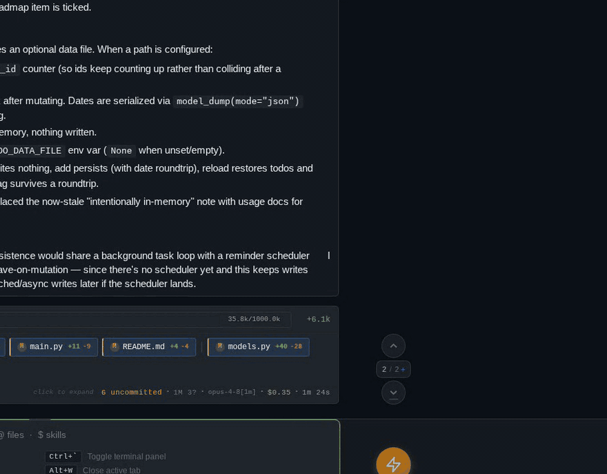
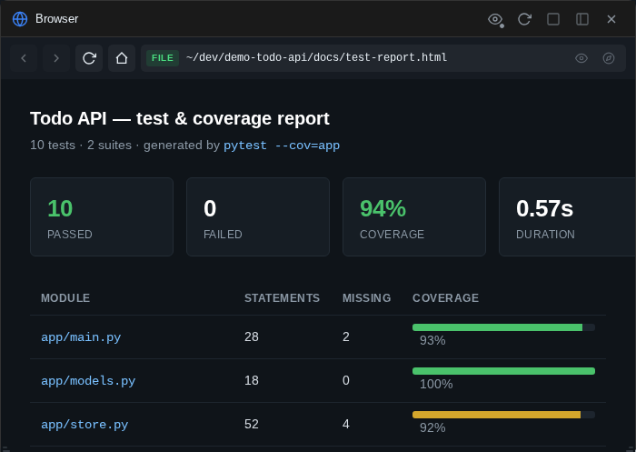

# Files, preview & editing

Everything Claude touches is one click away: a file explorer with live git status, a preview widget with rendered views for a dozen file types, and a real CodeMirror editor — no SSH session required.

## The file explorer

Press ++alt+f++ to open the file explorer — a floating tree of the session's working directory. Folders expand in place, breadcrumbs walk you back up, and it follows along when you switch sessions or projects.

Each file wears its git status as a colored badge: pencil for modified, plus for added, minus for deleted, a dotted circle for untracked, and a check for staged. Column headers sort by name, kind, modified time, or size, and type chips filter to code, images, docs, data, config, or archives.

The filter box searches as you type. Two toggles next to it control scope: whether the filter recurses into subfolders or stays in the current one, and whether `.gitignore`'d files are included.

Right-click (or long-press) for the context menu. On files: **Open in Editor**, **Preview**, **Open in Browser** (for HTML, SVG, PDFs, and images), **Copy Path**, **Insert to Chat**, **Copy Content**, and **Compare…** / **Select for Compare** for [two-file diffs](git-and-diffs.md#the-compare-wizard). On folders: **Enter Folder**, **Copy Path**, and **Open in Terminal**, which drops a shell there.

## Opening files from anywhere

You rarely need the explorer to reach a file. File paths are clickable throughout the app: in chat messages and tool-output blocks, in the per-turn summary bar's file pills, in [terminal output](terminal.md#clickable-output), and in the quick switcher (++cmd+k++ / ++ctrl+k++, which fuzzy-searches project files). A `path:line` reference opens the preview scrolled to that line, with the line highlighted.

## Search in files

++ctrl+shift+f++ (also ++cmd+shift+f++ on Mac) opens a VS Code-style **project-wide content search**: one query input with inline case-sensitive / whole-word / regex toggles, an optional filters row for include/exclude globs and ignored files, and results grouped per file with the match highlighted in context. Click a match (or press ++enter++) and the file preview opens at that exact line.

The search runs server-side over the session's project — ripgrep when it's installed, with a pure-Python fallback (the panel tells you when it's running in the slower fallback mode).

## The file preview

The preview opens as a floating window on desktop (bottom sheet on phones and tablets) and can be promoted to a full tab — each preview tab keeps its own file, scroll position, and edit state, so you can keep several files open at once. Header buttons copy the path, reveal the file in the explorer, copy the contents, or download it. ++alt+v++ (or the eye button on the left rail) reopens the last-previewed file — the way back after you close a preview with ++escape++.

For text files you get syntax highlighting with line numbers, a wrap toggle, and a language selector for when detection guesses wrong. Press ++ctrl+f++ / ++cmd+f++ while the preview is focused to search within the file; ++enter++ and the arrows step through matches.

A row of view tabs across the toolbar switches modes: **Code** (highlighted source), a rendered view for file types that have one, **Edit**, and **History** — a per-file diff browser over the [Shadow Git journal](shadow-git.md#getting-a-file-or-a-turn-back).

### Editing

Press ++e++ (or click the **Edit** tab) to flip the preview into a CodeMirror editor — code folding, bracket matching, its own in-editor search, and ++ctrl+slash++ / ++cmd+slash++ comment toggling. ++ctrl+s++ / ++cmd+s++ saves to disk; an unsaved-changes dot on the Edit tab and a confirm-on-close guard keep you from losing work. ++e++ or ++escape++ takes you back to the code view.

### Files reload themselves

While a preview is open, the widget polls the file's modification time every few seconds. If Claude (or anything else) changes the file on disk, the view reloads silently — you always look at the current contents. The one exception: if you're in edit mode *with unsaved changes*, a notification bar appears instead ("File changed on disk", with **Reload** and **Dismiss** buttons), so your edits are never clobbered.

### Rendered views

The preview picks a plugin by file type; each adds a rendered view alongside the raw code view:

- **Markdown** (`.md`) — rendered by default, with YAML front matter shown as a neat header. Press ++e++ in the rendered view to enter *quick edit*: click any block — paragraph, heading, list item, blockquote — and edit its raw markdown in place. ++enter++ saves to disk, ++shift+enter++ adds a newline, ++escape++ cancels. Task-list checkboxes (`- [ ]` / `- [x]`) become clickable and toggle straight through to the file.

    

- **Images** (PNG, JPEG, GIF, WebP, SVG, ICO, BMP) — a pan-and-zoom canvas with **Fit**, **1:1**, and zoom controls.
- **CSV / TSV** — parsed into an interactive table (quoted fields and embedded newlines handled properly).
- **JSON / JSONL** — a collapsible tree view with live search and expand/collapse-all; JSONL gets one tree per line.
- **Excalidraw** (`.excalidraw`) — the server renders the drawing to SVG, shown in the pan-zoom canvas with a light/dark toggle.
- **Vega-Lite charts** (`.vl.json`) — server-rendered to SVG, same canvas.
- **HTML** — a **Rendered** tab loads the page in a sandboxed iframe, with relative assets resolved.

## Scratch pads

++ctrl+n++ opens a *scratch tab*: a blank CodeMirror editor with no backing file — perfect for drafting a prompt, staging a snippet, or taking notes. Scratch content auto-saves locally as you type and survives reloads. Pick a language for highlighting, and when a draft graduates to a real file, **Save As** writes it to disk and the scratch tab becomes a normal file tab.

## The browser widget

Press ++alt+b++ for a small in-app browser — handy for checking the HTML report Claude just generated, or keeping docs open next to the chat.

It has two modes, picked automatically from what you type in the URL bar:

- **Local files** — enter a path (or use **Open in Browser** from the file explorer) and the server renders the HTML with its relative assets intact.
- **External URLs** — fetched through a same-origin proxy on the bridge that strips frame-blocking headers (`X-Frame-Options` and friends) and rewrites sub-resources, so most sites load inside the widget. The shield toggle next to the URL bar switches the proxy off for direct loading — better fidelity, but frame-blocking sites will refuse to render.

Back/forward/reload/home buttons work as you'd expect, and like the terminal, each chat session keeps its own URL and history. Buttons at the end of the URL bar hand the page off to the file preview or your system browser.

!!! note "Sandboxed by design"
    Pages always run in a sandboxed iframe with a null origin: scripts execute, but they can't read bridge cookies or call authenticated APIs, can't open popups, and can't navigate the app away. Treat it as a viewer, not a full browser — logins and complex web apps generally won't work through the proxy.

## Uploaded files

The **Uploads** widget shows everything you've pasted or dropped into the current session — a thumbnail grid for images and a list for other files, refreshed automatically when you send attachments. Click a thumbnail to zoom it, or a file to open it in the preview; a toggle widens the view from this session to all uploads.
