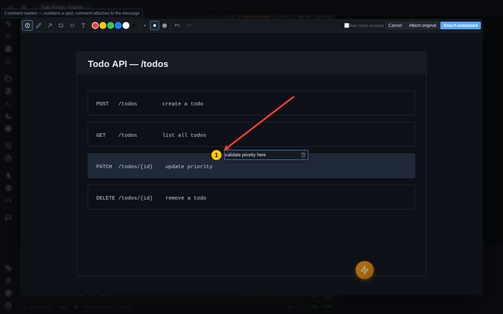

# Images & annotation

Paste a screenshot, draw an arrow on the bug, drop a numbered comment on it, and send — Claude gets the annotated picture and your comments as structured context.

## Getting images and files into the chat

Three ways in:

- **Paste** — ++cmd+v++ / ++ctrl+v++ an image from the clipboard while the message input is focused. The classic loop: screenshot the problem, paste, send.
- **Drag & drop** — drop images or any other files onto the chat area.
- **Picker** — the upload button in the input toolbar opens the system file picker for images or arbitrary files.

Pending attachments appear as **thumbnails and file chips** above the input until you send. Each thumbnail has a remove button, and clicking the thumbnail (or its **pencil button**) opens the annotation editor — annotating is the primary intent. File chips can be clicked to preview, or right-clicked / long-pressed for a menu (preview, copy path, delete).

Images travel inside the message as base64 image blocks; other files are saved into the session's upload directory on the server and referenced by path in your prompt ("Uploaded file: …"), so Claude reads them with its own tools.

### Server-side processing

Every image upload is optimized on the server before it reaches Claude:

- Resized so the longest edge is at most **1568 px** (Claude's recommended maximum) — no point paying tokens for retina pixels the model downsamples anyway.
- Recompressed: images with transparency stay PNG, everything else becomes quality-85 JPEG.
- Upload limits: 20 MB per image, 10 MB per other file.

### Attachments survive a refresh

Pending images and files are bound to the session on the server, not just to the page. Reload the browser (or come back on another device) and un-sent attachments are restored above the input, ready to go. Switching between session tabs also keeps each tab's pending attachments separate.

The **Uploads** widget (button in the toolbar) is a browser for everything uploaded to the current session — an image thumbnail grid plus a file list, with a toggle to show uploads from all sessions in the project.

## The annotation editor

Pasting a screenshot can open a paint-style **annotation editor** before anything is uploaded — circle the broken button instead of writing a paragraph about where it is.

### Opening it

The editor is **opt-in**. Turn it on in **Settings → Appearance → "Annotate images on paste"** (++ctrl+comma++). With it enabled, every pasted image opens the editor first.

Whichever way the setting points, ++cmd+shift+v++ / ++ctrl+shift+v++ does the **opposite**: with auto-annotate off (the default), Shift-paste opens the editor for just this one image; with it on, Shift-paste skips the editor and uploads plain.

You can also annotate after the fact: click any pending thumbnail (or its pencil button) to open the editor, and the annotated result replaces the original in the pending list. Works repeatedly, so you can keep refining.

!!! note
    Animated GIFs skip the editor — exporting through a canvas would flatten them to a single frame.

### Tools

The toolbar offers six tools, six color swatches, and three stroke sizes:

| Tool | What it does |
|------|--------------|
| **Comment marker** (default) | Drops a numbered badge and opens a comment box — see below |
| **Pen** | Freehand drawing |
| **Arrow** | Straight arrow with a filled head |
| **Rectangle / Ellipse** | Outline shapes |
| **Text** | Click to place a text label; type, then ++enter++ |

**Undo/redo** (++ctrl+z++ / ++ctrl+shift+z++, or the toolbar buttons) walk the shape history — every stroke is a vector object, so undo is exact.

Three buttons finish the job: **Attach annotated** (also plain ++enter++, or ++cmd+enter++ / ++ctrl+enter++) exports the drawing as a PNG and attaches it, **Attach original** uploads the untouched image, and **Cancel** (++escape++) discards the paste entirely. Once you've drawn something, Cancel/Esc arm a two-step **"Discard changes?"** confirm — press again within a few seconds to actually throw the drawing away.

### Numbered comment markers

The marker tool is the reason the editor exists. Click anywhere to drop a **numbered yellow badge** and type a comment into the floating box beside it. The badge is drawn onto the image; the comment text is **not** — it goes into the [Comments Stash](stash-and-discussions.md) instead, as items that attach to the same message as the picture. In the stash picker they're listed as `screenshot.png · marker 1`; in the prompt they become a block headed `**Marker 1 on screenshot.png:**` with your comment quoted underneath.

So Claude receives: a screenshot with badges ①②③ burned in, plus a context block above your prompt — "I'm referencing the numbered markers drawn on the attached screenshot:" followed by one `**Marker N on <file>:**` entry per badge. The badge anchors the spot; the prose stays machine-readable text instead of pixels.

!!! note "Mixed stash, generic lead-in"
    That marker-specific lead-in is only used when *every* attached stash item is a marker. Add a text selection to the stash alongside your markers and the block falls back to the generic "I'm referencing these code sections:" header — the `**Marker N on …**` entries are still there, just under the other heading.

Marker handling details:

- A translucent **ghost badge** follows your cursor so you can see exactly where the next marker will land.
- **Click** an existing badge to edit its comment; **drag** it to reposition (the comment survives the move).
- The comment box has a **trash button** to delete the marker; a brand-new marker closed without a comment removes itself.
- Markers always renumber to 1, 2, 3… with no gaps, and only markers that actually carry a comment become stash items.

Before sending, the marker comments sit in the stash like any other item — open the stash picker to review or edit them, and they clear automatically after the message goes out.
