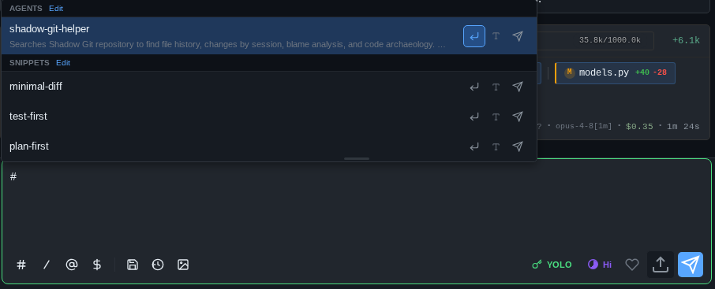

# Writing prompts & commands

The message box is more than a textarea — it has trigger characters for files, snippets, agents and skills, shell and plan input modes, history recall, and drafts that survive a page reload.

## The message box

On anything with a physical keyboard, ++enter++ sends and ++shift+enter++ adds a newline. On a phone (no hardware keyboard detected), ++enter++ adds a newline and you send with the button — thumbs hit Enter too easily mid-thought.

Two send variants worth knowing:

- ++cmd+shift+enter++ / ++ctrl+shift+enter++ sends your message in a **fresh session** cloned from the current one (same project, empty context) — for when the prompt you just wrote deserves its own context window.
- While Claude is working, the input stays live — a **follow-up** button appears that queues your message after the current turn.

Whatever you type is auto-saved as a per-session draft on every keystroke, so a reload, tab switch, or crashed PWA doesn't eat a half-written prompt. When the input is empty, a small cheat-sheet of keyboard shortcuts shows above it — you can pick which ones in Settings.

## Prompt history

++arrow-up++ on an empty input walks back through the prompts you've sent in this session, fish-shell style; ++arrow-down++ walks forward and finally restores whatever you had typed before browsing. Editing the recalled text (or moving the cursor) exits history mode and keeps the text. Each session remembers its last 50 prompts, and forks inherit the parent's history.

For history across *all* sessions and projects — with full-text search, favorites, and reuse/fork actions — open the prompt explorer with ++alt+p++ or ++ctrl+r++ (see [Cost analytics & prompt history](analytics-and-history.md)).

## Trigger pickers: `@` `#` `/` `$`

Four characters open pickers inline as you type. Press ++tab++ in the input to cycle through them without typing the character; matching toolbar buttons above the input do the same. In all pickers: ++arrow-up++/++arrow-down++ to choose, ++enter++ or ++tab++ to insert, ++escape++ to dismiss.

### `@` — files

Type `@` (at the start or after a space) and get fuzzy file suggestions from the current project. Type part of a name to filter, or end with `/` to list a directory's contents and drill in — selecting a directory appends `/` so you can keep drilling. ++cmd+enter++ or ++alt+enter++ on a selection opens the file in the preview instead of inserting the path.

### `#` — snippets & agents

`#` lists your saved text snippets alongside agents discovered from `~/.claude/agents/` and the project's `.claude/agents/`:

Selecting a snippet inserts its text. Selecting an agent inserts an invocation phrase (default: `Consult with agent <name>`, customizable per agent). ++alt+enter++ inserts just the name; ++cmd+enter++ / ++ctrl+enter++ inserts *and sends* in one stroke. Snippets are stored server-side, so they follow you across devices.

### `/` — commands

A `/` at the very start of the input (only there — mid-text slashes are left alone) opens command autocomplete over the whole catalog: built-in pAInapple Code commands, your Claude Code custom commands, and plugin commands. See the [command reference](../reference/commands.md) for the full list.

### `$` — skills

`$` anywhere in the prompt suggests installed skills and inserts an invocation — handy for weaving a skill into a longer instruction.

## Input modes

Two prefixes flip the whole input into a different mode — the box restyles and the placeholder changes so you can't mistake where your keystrokes go. Press ++backspace++ on an *empty* input to leave a mode (your text stays, prefix restored).

**Shell mode (`!`)** — type `!` and the rest of the line is a shell command, with autocomplete over your recent commands. It runs on the *server* (in the session's working directory) without involving Claude; output appears in the chat as a collapsible block, and is truncated at 3,000 characters. A command that hasn't finished in **30 seconds** is cut off.

!!! note "`!` doesn't use your login shell"
    Bang commands don't run under the same shell as the [terminal tab](terminal.md). On Linux and macOS they run under `/bin/sh`, not your `$SHELL` — so fish and zsh aliases, functions, and syntax aren't available. On Windows they run under **Windows PowerShell** (`powershell.exe -NoProfile`), so they're PowerShell-flavored rather than `sh`-flavored — and note that's 5.1 even if you have PowerShell 7 installed and the terminal tab is using `pwsh`. Outputs are also buffered and quietly prepended to your next message, so you can run `!pytest`, read the failures, and then just type "fix these" — Claude sees the command and its output.

**Plan mode (`/plan `)** — typing `/plan ` switches the input into plan compose mode and flips the [permission mode](permissions-and-thinking.md) to read-only Plan for that message.

!!! warning "Shell mode is real shell"
    `!` commands execute as the server user with no sandbox. That's the point — but read [the security notes](../getting-started/security.md) before exposing the server beyond localhost.

## Attachments

Paste, drag-drop, or click the attach button to add images and files to a message — screenshots can be annotated with arrows and markers before sending. Details in [Images & annotation](images-and-annotation.md).

## While Claude works: the activity strip

Instead of anonymous typing dots, the input border hosts a live activity strip showing what Claude is doing right now — *Thinking…*, *Reading server.py*, *Running pytest*, *3 agents · ×42 tools* — with an elapsed timer. Background sessions show the same state as a colored dot on their tab.

## On mobile

On phones and tablets a keyboard extension bar sits above the on-screen keyboard with ++ctrl++, ++alt++, arrows, and common keys — see [iPad & mobile](ipad-and-mobile.md).
