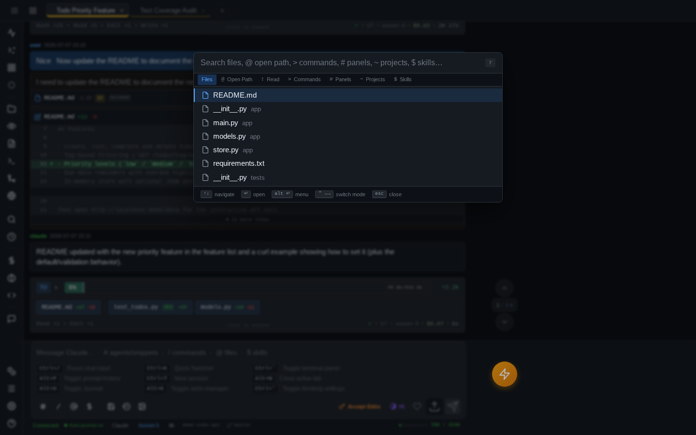
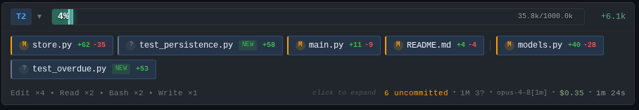
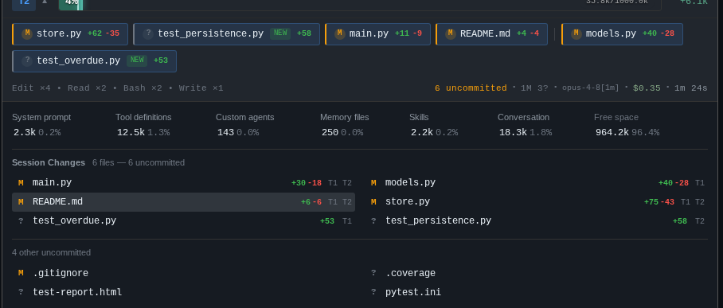

# Sessions & tabs

Each tab in pAInapple Code is its own Claude Code session — its own conversation, working directory, and subprocess on the server — and you can run several of them side by side, browser-style.

## The tab strip

Press ++cmd+t++ / ++ctrl+t++ (or the **+** button) to open a new tab. It lands on the [welcome screen](welcome-screen.md), where you pick a project and type your first prompt. While a session is still empty, a **setup panel** above the input offers one-tap rows for the [AI engine](engines.md), model, permission mode, effort, and account — tune the session, then just start typing. There is no limit on how many sessions you can have open at once — once the tab strip runs out of room it collapses the overflow into a **+N** chip.

Session tabs share one strip with *widget tabs* — terminals, file previews, and scratch editors opened as tabs interleave freely with sessions, so a terminal can sit right between two conversations. Each session tab shows a status dot (lit while Claude or the auto-journal is working), an unread dot for background activity, and a **?** badge when Claude is waiting for [an answer from you](#when-claude-asks-you-a-question).

Managing tabs:

- **Close** — the × on the tab, ++alt+w++, or ++cmd+w++ / ++ctrl+w++ in the PWA. Closing a tab does *not* delete the session — reopen it any time from the welcome screen.
- **Reopen** — ++cmd+shift+t++ / ++ctrl+shift+t++ brings back the last closed tab, just like a browser.
- **Rename** — right-click (or long-press) the tab → **Rename**.
- **Reorder** — drag tabs with the mouse or trackpad. On touch, long-press to pick a tab up, then drag; release in place to get the context menu instead. The menu also has **Move Left** / **Move Right**.
- **Pin** — any tab, session *or* widget, can be pinned from its context menu. Pinned tabs sort to the front of the strip and are skipped by **Close All** / **Close Others** (an explicit single close still works). Reordering stays within the pinned group.
- **Set color** — every project gets a stable accent color on its tabs and welcome cards automatically; **Set color** in the context menu overrides it with a swatch of your choice (saved server-side, so it follows you across devices). See [the welcome screen](welcome-screen.md#project-colors).
- **Context menu** — right-click a session tab for Copy Session ID / URL / CWD, Fork, Clone, Rename, Favorite, Pin, Set color, Close, and Close Others.

!!! note "Tabs survive your browser"
    Open tabs, widget tabs, and their order are saved server-side (not just in `localStorage`), so your layout comes back intact after a page reload — even on iPad, where the PWA's localStorage is notoriously flaky.

## Switching sessions

The basics: ++cmd+1++ … ++cmd+9++ jump to a tab by position, ++cmd+bracket-left++ / ++cmd+bracket-right++ step to the previous/next tab (++ctrl++ on Windows/Linux). Beyond that, four pickers cover different moods:

### Quick switcher

++cmd+k++ or ++cmd+p++ (++ctrl+k++ / ++ctrl+p++) opens a fuzzy finder. A row of tabs under the search box holds the modes — click or tap one to switch, or type its prefix character and the matching tab lights up. The active tab also carries the result count. ++ctrl+arrow-left++ / ++ctrl+arrow-right++ step between modes from the keyboard.



| Tab / prefix | Searches |
|--------------|----------|
| **Files** *(default)* | Files in the project, recency-ranked |
| `@` | Hands off to the [Open dialog](#open-dialog) (filesystem paths) |
| `!` | Files Claude has read this session |
| `>` | Commands (every quick action) |
| `#` | Panels and widgets |
| `~` | Projects — press ++arrow-right++ on a project to drill into its sessions, ++arrow-left++ to back out |
| `$` | Skills |

++enter++ opens the selected item; ++alt+enter++ opens a context menu with alternatives (open in background tab, copy path, and so on).

### Command palette

++cmd+shift+p++ (++ctrl+shift+p++ or ++f1++ on Windows/Linux) is the quick switcher pre-set to `>` mode — a searchable list of every command, VS Code style.

### Open dialog

++cmd+o++ / ++ctrl+o++ opens a filesystem path picker: type any path (`src/`, `~/`, `/etc`, `../`), ++tab++-complete as you go, and ++enter++ either previews a file or enters a folder. From any folder, **Open this folder** starts a new session there; if the path doesn't exist yet, **Create this folder** makes it first. Press ++backspace++ on an empty query to hand back to the quick switcher.

### Grid switcher

++alt+tab++ (Mac/iPad; ++ctrl+shift+bracket-right++ / ++ctrl+shift+bracket-left++ on Windows/Linux) or the **All sessions** header button opens an iPad-style card grid of every open session — each card shows the last message, turn count, working directory, and any pending-question or plan-ready badge. With ++alt+tab++ it behaves like the OS app switcher: hold ++alt++, tap ++tab++ to cycle, release to switch. Opened any other way, it stays up until you click a card or press ++escape++.

## Sessions keep running without you

Claude subprocesses are bound to session IDs on the server, not to your browser connection. Close the lid, lose Wi-Fi, or reload the page mid-turn — Claude keeps working, and when the client reconnects it reattaches to the running session and backfills anything you missed. Background tabs sync the same way, lighting up their unread dot.

The **stop** button is the exception: it sends an interrupt to the running Claude process, ending the turn.

## Fork, clone, and branch

Two ways to spin a session off an existing one, both in the tab context menu:

- **Fork** creates a new session that *branches the conversation* — Claude starts with the full context of the original (via the CLI's `--fork-session`), so you can explore an alternative direction without polluting the original thread. `/fork` does the same, and `/fork-compact` forks and immediately compacts the copy.
- **Clone** (++cmd+n++ / ++ctrl+shift+n++) creates a fresh, empty session in the *same working directory* — same project, blank slate.

There's also a send-time shortcut: ++ctrl+shift+enter++ (or ++cmd+shift+enter++) sends whatever you've typed in a brand-new clone instead of the current session — handy when you realize mid-prompt that this question deserves its own context window.

## When Claude asks you a question

When Claude uses its AskUserQuestion tool, the answer UI renders as an interactive form right in the chat — option buttons (or a grouped wizard when several questions arrive at once), an **Other…** option for a free-text answer, and an **Ignore** button to dismiss without answering. A **comment box** below the options lets you add free-text context to whatever you picked (or send a comment alone, without picking an option). Sending a regular message auto-dismisses any pending question. Tabs and grid-switcher cards show a **?** badge while a question (or a plan approval) is waiting.

Answered cards keep an **Edit** button — reopen the form, change your picks or comment, and resend, without retyping the whole answer as a new prompt.

By default pAInapple Code *stops* Claude on these questions so you can answer. You can flip that off in **Settings** ("Stop on questions"): the question is then auto-denied and Claude keeps going on its own judgment — the card stays in the transcript with a note explaining what happened.

## The turn summary bar

After every turn, an inline bar summarizes what just happened:



Reading it left to right:

- **Turn number** and an expand chevron.
- **Context bar** — how full the context window is (percentage and tokens against the usable window), with this turn's gain highlighted and a token delta on the right. The bar shifts to warning colors as you approach auto-compact territory.
- **File pills** — every file changed this turn, with `+/-` line counts and a `new` badge for created files, followed by session-accumulated changes and thumbnails of images Claude read. Pills are live: tap one for a diff/preview, long-press for compare presets (this turn's changes, to session start, to git HEAD, …). Git status dots are overlaid asynchronously.
- **Tools row** — tool-call counts (`Edit ×3  Bash ×2`), duration, cost, and which model ran.

Click the bar to expand the full context-window breakdown — system prompt, tools, messages, autocompact buffer, and free space — plus the complete list of files changed so far this session:



## Continue in the CLI

Every session here is a real CLI session. Grab the ID from the tab context menu (**Copy Session ID**) and pick the same conversation up in your terminal:

```bash
claude --resume <session-id>
```

Easier still, the **Continue in CLI** quick action copies the exact resume command for the session's [engine](engines.md) — `claude -r <id>` for a Claude session, `codex exec resume <id>` for a Codex one.
