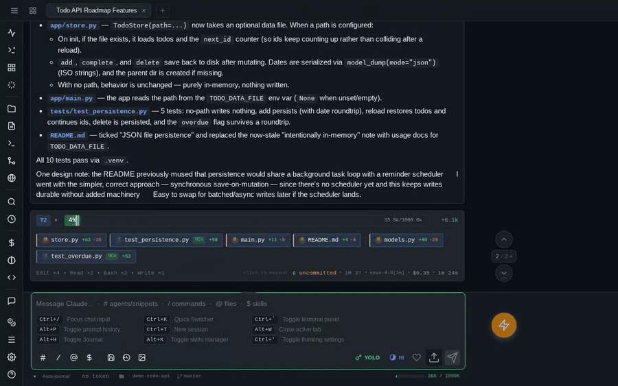

# Embedded terminal

A real PTY in your browser — xterm.js on the front, a persistent shell process on the server — so you can run tests, poke at git, or drive the Claude CLI directly without leaving the chat.

**Which shell you get:** on Linux and macOS, your `$SHELL` — started interactively (`-i`) — falling back to `/bin/bash` when the variable is unset. On Windows it's a ConPTY session running PowerShell 7 (`pwsh.exe`) if it's on `PATH`, otherwise Windows PowerShell (`powershell.exe`); `PAINAPPLE_CODE_SHELL` overrides that choice. The override is **Windows-only** — on Linux and macOS the shell is `$SHELL` and nothing else.

!!! note "`!bang` commands don't use the same shell on Windows"
    [Bang commands](../reference/commands.md#bang-commands) run through a separate one-shot process, and on Windows that one is always `powershell.exe` (Windows PowerShell 5.1) with `-NoProfile -NonInteractive` — it does not prefer `pwsh` and does not read `PAINAPPLE_CODE_SHELL`. So on a machine with PowerShell 7 installed, the terminal tab gives you `pwsh` while `!bang` gives you 5.1. On Linux and macOS bang commands go through `/bin/sh`, so they're POSIX-flavored even when your terminal is fish or zsh.

!!! danger "This is a real shell"
    The terminal is not a sandbox: it runs as the same OS user as the server, with that user's full filesystem and network access. Anyone who can log into pAInapple Code can run arbitrary commands. Read [the security notes](../getting-started/security.md) before exposing the server beyond localhost.

## Opening and toggling

Press ++ctrl+grave++ or ++ctrl+backslash++ to toggle the terminal for the current session. It opens as a **top sheet** sliding down from the top on phones and tablets (drag between half and full height), and as a **floating window** on desktop. Either form can be promoted to a full **tab** in the tab strip — use the widget's transform controls or the **+** button in the terminal header, which opens a fresh terminal tab (`Terminal 1`, `Terminal 2`, …).

++ctrl+shift+grave++ (or ++ctrl+shift+c++ / ++cmd+shift+c++) skips the floating stage and opens a new terminal tab directly. Terminal tabs live in the same [unified tab strip](sessions.md#the-tab-strip) as your sessions, so a shell can sit right between two conversations, and you can open as many as you need.

When you promote a floating terminal to a tab, the running shell and its scrollback move with it — nothing restarts.

A couple of desktop niceties:

- Right-click the floating terminal's header to **save its current size as the default**, or restore the configured default.
- ++escape++ is deliberately passed through to the shell (so it works in vim, fzf, etc.) instead of closing the widget.
- ++ctrl+c++ sends an interrupt to the shell; ++cmd+c++ copies the selection (with soft-wrapped lines joined back together); ++cmd+v++ pastes, honoring bracketed-paste mode.

## Terminals survive the page

Each PTY is keyed to your session and working directory on the server, not to the browser tab. Reload the page, switch sessions and come back, or lose your connection — the shell keeps running, and the widget reattaches to it with scrollback intact.

If a client goes away entirely, its shells become **orphaned terminals**: still running on the server, just not attached to any window. A header button with a badge lists them; from there you can reattach any of them as a tab (**Tab All** grabs the lot) or kill them. The kill button in the terminal widget's header ends the current shell explicitly.

Each session gets its own floating terminal, opened in that session's working directory. Change the session's project and the terminal reconnects there.

## Clickable output

Terminal output is linkified as you go:

- **URLs** open in a new browser tab — even when they wrap across multiple terminal lines.
- **File paths** (including bare filenames like `server.py` and `path:line` references like `src/app.js:42`) are verified against the server and open in the [file preview](files.md) on click, jumping to the line when one is given. ++ctrl++-click (or ++cmd++-click) opens the file straight in edit mode.
- **Directories** open in the file explorer instead.

Resolution is context-aware: it tracks the shell's *live* working directory (your `cd`s count), and when you click a bare filename it also scans the lines above for directory context — so a filename in the output of `ls docs/guides/` resolves into `docs/guides/`.

!!! note "Live `cd` tracking under PowerShell"
    PowerShell's `cd` changes its own *provider location*, which it never pushes down to the Win32 process working directory — so on Windows the terminal reports the directory it was started in rather than following your `cd`s. Paths still resolve; they're just anchored to the session's directory. (`cmd.exe` does update the process CWD, if you set `PAINAPPLE_CODE_SHELL` to it.)

## Clipboard writes from terminal programs (OSC 52)

Programs running in the terminal can ask to put text on your system clipboard via the OSC 52 escape sequence — it's what makes `y` in vim (Neovim 0.10+ speaks it natively; tmux needs `set -g set-clipboard on`) reach your real clipboard even over SSH.

**This is off by default**, because it cuts both ways: *anything* that prints to the terminal — a script you run, output `cat`-ed from a file, a process on a remote SSH host — can use it to silently replace what you just copied. Classic move: swap the command you copied for a malicious one and wait for you to paste it into a shell. Turn it on in **Settings → Appearance → "Terminal apps may write to clipboard"**; a blocked attempt shows a toast pointing at the setting, so you'll find it exactly when you want it.

With it enabled, three guardrails stay on unconditionally:

- **Every write is announced** by a toast with the character count — a clipboard change you didn't ask for is never silent.
- **Reading the clipboard is never allowed.** The OSC 52 read form is consumed and refused, so a terminal program can't see what you've copied.
- **Reconnects never replay writes.** Scrollback replayed after a reconnect (which iPad PWAs do constantly) is stripped of clipboard sequences server-side, so an hour-old yank can't re-hijack your clipboard when a tab wakes up.

## Logging into Claude from the terminal

The Claude CLI's OAuth login is interactive, so the `/login` slash command drops you into a terminal tab pre-typed with `claude auth login` — follow the prompts there. If the CLI hits an expired or missing token mid-session, the error card in the chat includes a one-click **Login** button that opens the same terminal. `/logout` mirrors this with `claude auth logout`.

## Touch controls

On phones and tablets a **keyboard extension bar** sits above the software keyboard, filling in what iOS and Android keyboards lack: ++escape++, ++tab++, ++ctrl++, ++alt++, arrow keys, common shell characters (`|` `~` `/` `-`), backspace, and a paste button.

Modifier keys have two modes:

- **Single tap** — one-shot: the modifier applies to the next key you type, then clears.
- **Double tap** — locked: stays active (like caps lock) until you tap it again.

**Long-press** keys for shortcut popups: hold ++ctrl++ for a menu of common chords (Ctrl+C interrupt, Ctrl+D EOF, Ctrl+Z suspend, Ctrl+L clear, Ctrl+A/E home/end), hold ++alt++ for word-editing chords, and hold the left/right arrows for Alt/Ctrl word-jump variants. Slide to an option and release, or lift your finger and tap one.

There's also a **virtual joystick**: touch the terminal and swipe about 20 px in any direction to summon a d-pad anchored at your fingertip. The direction you're holding auto-repeats (great for scrolling through shell history or a pager); drag toward another arrow to change direction, release to dismiss. A quick **double-tap** on the terminal sends ++tab++ for shell completion.
