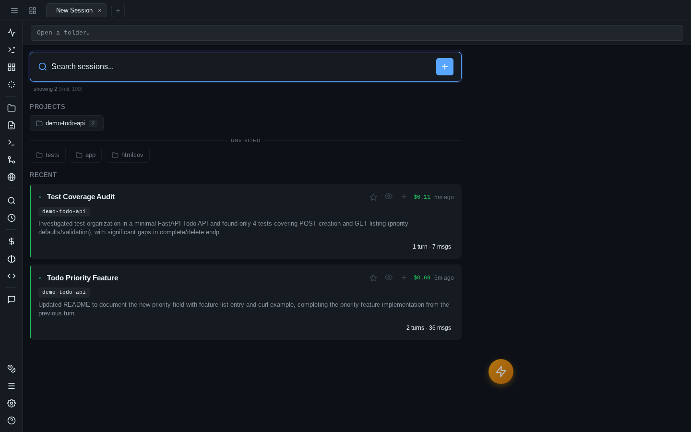

# Welcome screen

Every new tab opens on the welcome screen — a launcher that combines your projects, favorite sessions, and recent work into one searchable view, so picking up where you left off is one click.

## Starting a session

The fastest path: click a project chip under **Projects** and start typing. Chips are your known projects, sorted by how many sessions each has (the count badge); below them, an **Unvisited** row lists sibling directories in your workspace you haven't opened yet — new repos show up here before they have any history. Right-click (or long-press) a chip for more: **New Session**, **New Terminal**, **New Browser**, **New Draft**, or **Reopen Closed**.

If your project isn't in the chips, use the connection bar's open button or ++cmd+o++ / ++ctrl+o++ to bring up the [Open dialog](sessions.md#open-dialog) — type any path with tab-completion, and **Open this folder** starts the session there. If the directory doesn't exist yet, you'll be offered to create it first.

You can also just type your prompt into the message box straight away: if no project is selected, the Open dialog pops up to ask where, and your message sends as soon as you've picked a folder.

!!! tip "Working across multiple directories"
    A session's Claude process is rooted in one working directory. To let it touch sibling repos or shared folders, add **extra directories** in **Settings** (globally or per project) — they're passed to Claude as `--add-dir`.

## Recent sessions and families

Below the launcher sections, **Recent** shows your latest sessions as rich cards. The name, one-line summary, and tags aren't typed by you — they come from the [Shadow Git auto-journal](shadow-git.md), which summarizes every turn in the background. Each card also shows the count of files changed, total cost, and when the session was last active. Sessions without a journal summary yet fall back to their first prompt.

Sessions that were [forked](sessions.md#fork-clone-and-branch) from one another render as a *family*: the root session card carries its fork branches and discussion threads underneath, with a combined family cost, so an exploration tree reads as one unit instead of scattered cards. Click a family to expand its branches.

Only a handful of families show at first — **Show N more** loads the rest, and a limit selector in the search bar controls how many sessions load at all.

Click any card to open the session in the current tab. The context menu (right-click, or long-press on touch) offers more:

- **Add to Favorites** / **Remove from Favorites**
- **Rename**
- **Open** / **Open in New Tab**
- **Quick Preview**
- **Copy Session ID** / **Copy Session URL**
- **Fork Session** — branch it without opening it first
- **New Session on Project** — fresh session in the same directory

## Search and filtering

The search bar at the top filters everything live — sessions (by name, summary, and project), project chips, and favorites all narrow as you type.

To scope the view to one project, click the project name on any session card, or ++alt++-click a project chip (keyboard: ++alt+enter++ on a selected chip). The filter appears as a removable chip inside the search bar; text search then applies *within* that project. ++escape++ clears everything.

The whole screen is keyboard-navigable: arrow keys move through project chips, favorites, and session cards; ++enter++ opens the selection.

## Project colors

Every project is assigned a stable accent color out of the box — the project path hashes into a curated dark-theme palette, so the same project shows the same hue on session tabs, welcome cards, and project pickers, on every device, with zero configuration.

Don't like the assigned hue? Right-click a project (or a session tab) → **Set color** opens a swatch picker; your pick is saved server-side and overrides the automatic color everywhere.

## Favorites

Star a session (context menu → **Add to Favorites**) and it moves into a compact **Favorites** list above the recent cards — name, summary, project, and last activity in one row. Favorites are pinned discovery: they survive however deep the session sinks in the recent list. The star on each row un-favorites it, and **Show all N favorites** expands past the first batch. Favorited sessions also get a star on their tab when open.

## Quick preview

Not sure which session is the one? **Quick Preview** in the context menu slides up a bottom sheet with the session's most recent messages — a peek without opening it as a tab. From there, open it for real or dismiss and keep browsing.
