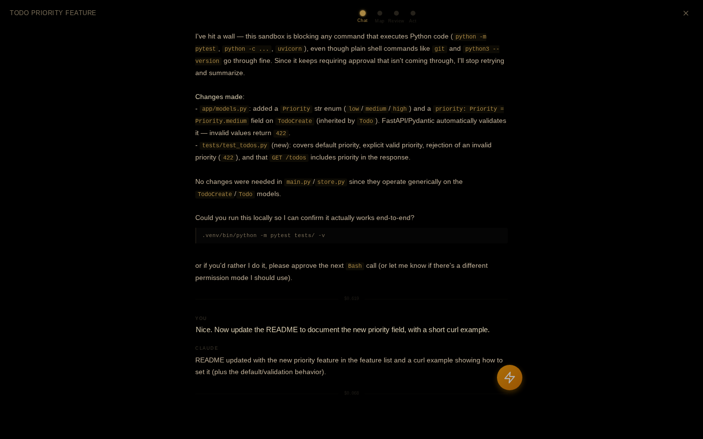

# Zen mode

Zen mode is a fullscreen, pure-black focus overlay for the active session — designed for dark rooms and OLED displays, with warm amber accents and almost no chrome.

!!! warning "Experimental — still in development"
    Zen mode is an experimental feature and still under active development. Views, layout, and behavior may change between releases, and rough edges are expected — especially in the Map and Review views, whose session analysis is heuristic.

Toggle it with ++alt+z++ (or the quick-actions menu). It covers the whole app: a slim top bar shows the session name, four navigation dots, and a close button — everything else is the current view.

Zen mode is read-only. It renders what the browser already has for the active session; there is no input box, and nothing you do here sends a message — except one button on the Act view, noted below.

## The four views

### Chat

The default view when you enter. A stripped-down conversation reader: your prompts and Claude's replies with minimal formatting (bold, inline code, code blocks), and everything noisy compressed —

- Tool calls collapse into terse one-line groups (`> Read server.py`, `~ Edit app.js`, `$ Bash …`).
- Thinking blocks become a dim, collapsed `thinking...` disclosure.
- Each turn ends with a thin divider showing its cost.

The view opens scrolled to the bottom, at the latest exchange.

### Map

An SVG mind map of the session, laid out radially: a glowing session node in the center, one node per turn arranged around it (labeled with the truncated prompt), and up to six file nodes branching off each turn — edited files drawn brighter than read ones, with a `+N` node when a turn touched more. Nodes and edges animate in when the view opens.

Click any node for a detail card: the session node shows totals (turns, files edited, tool calls, cost), a turn node shows its full prompt, a snippet of Claude's response, and the files it touched, and a file node shows the full path and whether it was read or edited. Click the background to dismiss the card.

### Review

A plain-text session summary: a stat row (turns, files edited, tool calls, and cost when known), a numbered conversation-flow timeline of your prompts, then two file lists — files changed and files read (capped at the first 20).

### Act

The simplest view: a "What would you like to do next?" prompt over four large buttons. Each one exits zen mode and then acts:

- **Continue** — back to the session with the message input focused.
- **View Diff** — opens the [git panel](git-and-diffs.md).
- **Commit** — sends `/commit` to Claude. This is the one Act button that sends a message.
- **New Session** — starts a fresh session.

## Navigating and exiting

Move between views by clicking the dots in the top bar, pressing ++arrow-left++ / ++arrow-right++ (they wrap around), a horizontal two-finger trackpad swipe, or a quick horizontal finger swipe on touch screens.

Exit with ++escape++, the × button, or ++alt+z++ again.

!!! note "It reads what the browser has"
    The Map and Review views are built by scanning the session's messages as loaded in the browser, so a session opened mid-history shows only the loaded portion, and file/tool detection is heuristic. For exact per-turn records, use [Shadow Git](shadow-git.md) and the history tools in [Cost analytics & history](analytics-and-history.md).
