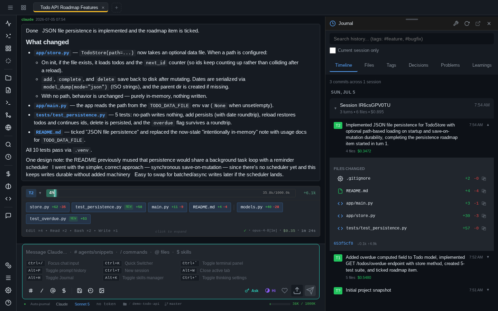

# pAInapple Code

A self-hosted web client for [Claude Code](https://github.com/anthropics/claude-code), installable as a PWA. The server **runs on your own machine** and drives Claude Code through the **official Agent SDK**, using **your own Claude subscription**. [OpenAI Codex CLI](guides/providers.md) support is experimental.
Inspired by [code-server](https://github.com/coder/code-server).

Thanks to the [**Auto Journal**](guides/shadow-git.md), you can easily **pull up the full history of any topic or file** you've already worked on. After each turn finishes, the session is forked in the background to a fast model (Haiku by default) that summarizes the turn — and the summary is stored in a local DuckDB and in the project's shadow git, as the commit message over everything that changed during the turn. **It's not just for you:** the optional `shadow-git-helper` agent gives Claude the same access, digging through past turns to brief the session with full historical context.

The **server** runs natively on Linux, macOS, and Windows 10/11 — no WSL required. Right now it's a PWA — installable on iOS, Android, and desktop — but **desktop and mobile apps are in development**. Roughly a third of this app was developed on an iPhone, and the rest on an iPad with a hardware keyboard.

!!! danger "Read the security notes first"
    **Whoever can authenticate gets the same shell and filesystem access as the server process itself.** The embedded terminal is a real PTY, and every approved tool call runs with the server's privileges — your OS user's on a bare host install, the sandbox's in container mode. This is an MVP, and all of its code was written by AI. Run it isolated (Docker, VM) and read [Read this first](getting-started/security.md) before exposing it to anything.

!!! warning "These docs were written by AI — read them with caution"
    Like the rest of this project, the whole documentation site was written by AI (Claude) reading the source code, not by a human writing from experience. It was fact-checked against the code at the time of writing, but it has not been fully human-reviewed, and the code moves faster than the docs do.

    Expect the occasional stale flag, renamed button, or feature described more confidently than it deserves. When something matters — security settings, CLI flags, data locations — trust the [source](https://github.com/wrotek/painapple-code) and `painapple --help` over this site, and please [open an issue](https://github.com/wrotek/painapple-code/issues) when the two disagree.

## What it is — and what it isn't

**It is** a thin wrapper around Claude Code. Every prompt streams through the official **Agent SDK** (the classic `claude -p` line protocol is available as an alternate provider), and sessions you create here can be resumed in the regular CLI with `claude --resume <id>`.

**It is not** an AI agent of its own. It never modifies Claude's system prompt, tool policy, or behavior — no injected planning steps, no hidden instructions, no parallelized work. What it *does* add to a prompt is the context **you** attached: the output of `!bang` commands you ran, paths of files you uploaded, and snippets from the comments stash are prepended as plain text. The one other exception is the optional `shadow-git-helper` agent, which knows how to query the Shadow Git history.

## Get started

- **[Install with pip / pipx](getting-started/install-pip.md)** — the recommended install: `pipx install painapple-code`, on Linux, macOS, or Windows.
- **[Run it in a container](getting-started/install-docker.md)** — the recommended way to *run* it: add `--in-docker` and each instance gets its own sandbox. Same install, no clone needed.
- **[Dev Containers & Codespaces](getting-started/install-devcontainer.md)** — add it to any devcontainer as a Feature.
- **[First run & login](getting-started/first-run.md)** — the generated password, the login URL, and your first session.

## Highlights

- **[Shadow Git auto-journal](guides/shadow-git.md)** — pull up the full history of any topic or file you've worked on: every turn is summarized by a fast model into git + DuckDB. Not a backup — a searchable record of what was done and why.
- **[Multi-session tabs](guides/sessions.md)** — several concurrent sessions, browser-style tabs, sessions survive page refresh and network drops.
- **[AI providers](guides/providers.md)** — Claude Code by default, experimental OpenAI Codex support when you want it, chosen per session — each with its own models, permission modes, and effort scale.
- **[Embedded terminal](guides/terminal.md)** — a real PTY with xterm.js, persistent across refresh, with a mobile keyboard extension bar.
- **[Comments stash & discussions](guides/stash-and-discussions.md)** — annotate any paragraph of a response and attach it to your next prompt, or fork a side-thread about it.
- **[Cost analytics & prompt history](guides/analytics-and-history.md)** — spend breakdowns per model/tool/session, and full-text search over every prompt you ever sent.
- **[Images & annotation](guides/images-and-annotation.md)** — paste screenshots, draw arrows and markers on them before sending.
- **[Installable PWA](guides/ipad-and-mobile.md)** — works as a standalone app on iPad, iPhone, Android, and desktop.

The full list lives in the [features overview](features.md).
